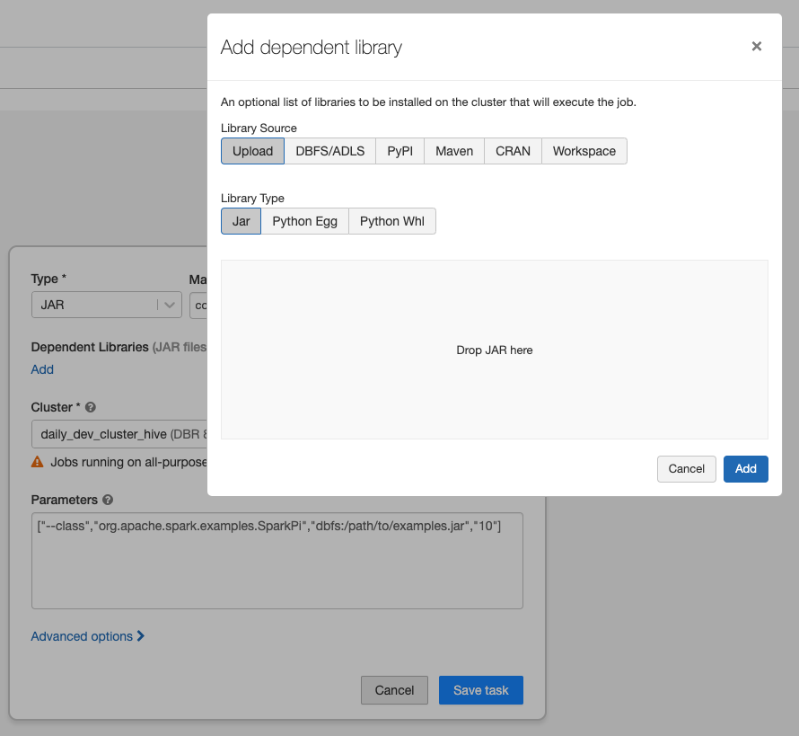
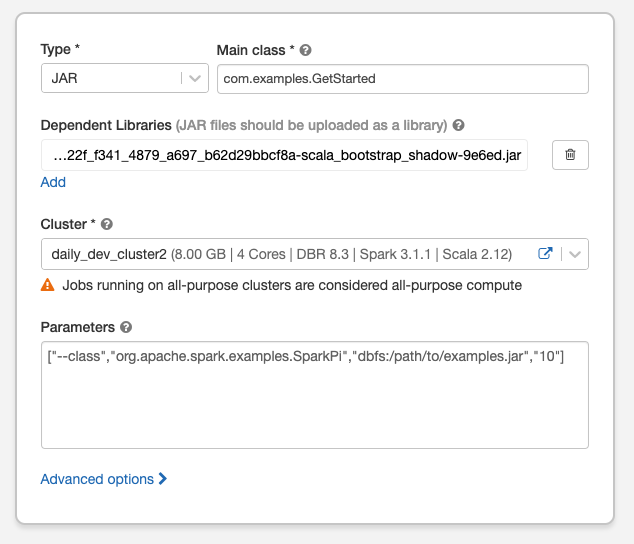

# Example-Project for Azure Debugging

- You can find Spark=3.1.1 and Scala=2.12 version in `build.gradle` file
(From [Spark official doc](https://spark.apache.org/docs/3.1.1/sql-data-sources-hive-tables.html#interacting-with-different-versions-of-hive-metastore), we found the built-in hive-schema-metastore version is 2.3.7 )

- Run `./gradlew clean buildJar` to build jar file.

- The jar file is located at  `build/libs/scala-bootstrap-shadow.jar`

You can create a job and upload the jar file there:


Specify the  Main class as follows and choose to use DBR 8.3 cluster:



After run the job, you will get the error message as follows:
```
21/09/25 08:04:05 ERROR ScalaDriverLocal: User Code Stack Trace: 
MetaException(message:Hive Schema version 2.3.0 does not match metastore's schema version 0.13.0 Metastore is not upgraded or corrupt)
	at org.apache.hadoop.hive.metastore.RetryingHMSHandler.<init>(RetryingHMSHandler.java:83)
	at org.apache.hadoop.hive.metastore.RetryingHMSHandler.getProxy(RetryingHMSHandler.java:92)
	at org.apache.hadoop.hive.metastore.HiveMetaStore.newRetryingHMSHandler(HiveMetaStore.java:6902)
	at org.apache.hadoop.hive.metastore.HiveMetaStoreClient.<init>(HiveMetaStoreClient.java:164)
	at org.apache.hadoop.hive.metastore.HiveMetaStoreClient.<init>(HiveMetaStoreClient.java:129)
	at com.examples.HiveMetaStoreUtil$.createHiveMetaStoreClient(HiveMetaStoreUtil.scala:19)
	at com.examples.HiveMetaStoreUtil$.getHiveMetaStoreClient(HiveMetaStoreUtil.scala:30)
	at com.examples.HiveMetaStoreUtil$.getHiveTableNonePartitionCols(HiveMetaStoreUtil.scala:50)
	at com.examples.HiveMetaStoreUtil$.getHiveTableNonePartitionColNames(HiveMetaStoreUtil.scala:46)
	at com.examples.GetStarted$.main(GetStarted.scala:67)
	at $line95bd927be0df4241a517b8efa4229f9f25.$read$$iw$$iw$$iw$$iw$$iw$$iw.<init>(command--1:1)
	at $line95bd927be0df4241a517b8efa4229f9f25.$read$$iw$$iw$$iw$$iw$$iw.<init>(command--1:43)
	at $line95bd927be0df4241a517b8efa4229f9f25.$read$$iw$$iw$$iw$$iw.<init>(command--1:45)
	at $line95bd927be0df4241a517b8efa4229f9f25.$read$$iw$$iw$$iw.<init>(command--1:47)
	at $line95bd927be0df4241a517b8efa4229f9f25.$read$$iw$$iw.<init>(command--1:49)
	at $line95bd927be0df4241a517b8efa4229f9f25.$read$$iw.<init>(command--1:51)
	at $line95bd927be0df4241a517b8efa4229f9f25.$read.<init>(command--1:53)
	at $line95bd927be0df4241a517b8efa4229f9f25.$read$.<init>(command--1:57)
	at $line95bd927be0df4241a517b8efa4229f9f25.$read$.<clinit>(command--1)
	at $line95bd927be0df4241a517b8efa4229f9f25.$eval$.$print$lzycompute(<notebook>:7)
	at $line95bd927be0df4241a517b8efa4229f9f25.$eval$.$print(<notebook>:6)
	at $line95bd927be0df4241a517b8efa4229f9f25.$eval.$print(<notebook>)
	at sun.reflect.NativeMethodAccessorImpl.invoke0(Native Method)
	at sun.reflect.NativeMethodAccessorImpl.invoke(NativeMethodAccessorImpl.java:62)
	at sun.reflect.DelegatingMethodAccessorImpl.invoke(DelegatingMethodAccessorImpl.java:43)
	at java.lang.reflect.Method.invoke(Method.java:498)
	at scala.tools.nsc.interpreter.IMain$ReadEvalPrint.call(IMain.scala:745)
	at scala.tools.nsc.interpreter.IMain$Request.loadAndRun(IMain.scala:1021)
	at scala.tools.nsc.interpreter.IMain.$anonfun$interpret$1(IMain.scala:574)
	at scala.reflect.internal.util.ScalaClassLoader.asContext(ScalaClassLoader.scala:41)
	at scala.reflect.internal.util.ScalaClassLoader.asContext$(ScalaClassLoader.scala:37)
	at scala.reflect.internal.util.AbstractFileClassLoader.asContext(AbstractFileClassLoader.scala:41)
	at scala.tools.nsc.interpreter.IMain.loadAndRunReq$1(IMain.scala:573)
	at scala.tools.nsc.interpreter.IMain.interpret(IMain.scala:600)
	at scala.tools.nsc.interpreter.IMain.interpret(IMain.scala:570)
	at com.databricks.backend.daemon.driver.DriverILoop.execute(DriverILoop.scala:219)
	at com.databricks.backend.daemon.driver.ScalaDriverLocal.$anonfun$repl$1(ScalaDriverLocal.scala:235)
	at scala.runtime.java8.JFunction0$mcV$sp.apply(JFunction0$mcV$sp.java:23)
	at com.databricks.backend.daemon.driver.DriverLocal$TrapExitInternal$.trapExit(DriverLocal.scala:903)
	at com.databricks.backend.daemon.driver.DriverLocal$TrapExit$.apply(DriverLocal.scala:856)
	at com.databricks.backend.daemon.driver.ScalaDriverLocal.repl(ScalaDriverLocal.scala:235)
	at com.databricks.backend.daemon.driver.DriverLocal.$anonfun$execute$13(DriverLocal.scala:544)
	at com.databricks.logging.UsageLogging.$anonfun$withAttributionContext$1(UsageLogging.scala:240)
	at scala.util.DynamicVariable.withValue(DynamicVariable.scala:62)
	at com.databricks.logging.UsageLogging.withAttributionContext(UsageLogging.scala:235)
	at com.databricks.logging.UsageLogging.withAttributionContext$(UsageLogging.scala:232)
	at com.databricks.backend.daemon.driver.DriverLocal.withAttributionContext(DriverLocal.scala:53)
	at com.databricks.logging.UsageLogging.withAttributionTags(UsageLogging.scala:279)
	at com.databricks.logging.UsageLogging.withAttributionTags$(UsageLogging.scala:271)
	at com.databricks.backend.daemon.driver.DriverLocal.withAttributionTags(DriverLocal.scala:53)
	at com.databricks.backend.daemon.driver.DriverLocal.execute(DriverLocal.scala:521)
	at com.databricks.backend.daemon.driver.DriverWrapper.$anonfun$tryExecutingCommand$1(DriverWrapper.scala:689)
	at scala.util.Try$.apply(Try.scala:213)
	at com.databricks.backend.daemon.driver.DriverWrapper.tryExecutingCommand(DriverWrapper.scala:681)
	at com.databricks.backend.daemon.driver.DriverWrapper.getCommandOutputAndError(DriverWrapper.scala:522)
	at com.databricks.backend.daemon.driver.DriverWrapper.executeCommand(DriverWrapper.scala:634)
	at com.databricks.backend.daemon.driver.DriverWrapper.runInnerLoop(DriverWrapper.scala:427)
	at com.databricks.backend.daemon.driver.DriverWrapper.runInner(DriverWrapper.scala:370)
	at com.databricks.backend.daemon.driver.DriverWrapper.run(DriverWrapper.scala:221)
	at java.lang.Thread.run(Thread.java:748)
Caused by: MetaException(message:Hive Schema version 2.3.0 does not match metastore's schema version 0.13.0 Metastore is not upgraded or corrupt)
	at org.apache.hadoop.hive.metastore.ObjectStore.checkSchema(ObjectStore.java:7825)
	at org.apache.hadoop.hive.metastore.ObjectStore.verifySchema(ObjectStore.java:7788)
	at sun.reflect.NativeMethodAccessorImpl.invoke0(Native Method)
	at sun.reflect.NativeMethodAccessorImpl.invoke(NativeMethodAccessorImpl.java:62)
	at sun.reflect.DelegatingMethodAccessorImpl.invoke(DelegatingMethodAccessorImpl.java:43)
	at java.lang.reflect.Method.invoke(Method.java:498)
	at org.apache.hadoop.hive.metastore.RawStoreProxy.invoke(RawStoreProxy.java:101)
	at com.sun.proxy.$Proxy64.verifySchema(Unknown Source)
	at org.apache.hadoop.hive.metastore.HiveMetaStore$HMSHandler.getMSForConf(HiveMetaStore.java:595)
	at org.apache.hadoop.hive.metastore.HiveMetaStore$HMSHandler.getMS(HiveMetaStore.java:588)
	at org.apache.hadoop.hive.metastore.HiveMetaStore$HMSHandler.createDefaultDB(HiveMetaStore.java:655)
	at org.apache.hadoop.hive.metastore.HiveMetaStore$HMSHandler.init(HiveMetaStore.java:431)
	at sun.reflect.NativeMethodAccessorImpl.invoke0(Native Method)
	at sun.reflect.NativeMethodAccessorImpl.invoke(NativeMethodAccessorImpl.java:62)
	at sun.reflect.DelegatingMethodAccessorImpl.invoke(DelegatingMethodAccessorImpl.java:43)
	at java.lang.reflect.Method.invoke(Method.java:498)
	at org.apache.hadoop.hive.metastore.RetryingHMSHandler.invokeInternal(RetryingHMSHandler.java:148)
	at org.apache.hadoop.hive.metastore.RetryingHMSHandler.invoke(RetryingHMSHandler.java:107)
	at org.apache.hadoop.hive.metastore.RetryingHMSHandler.<init>(RetryingHMSHandler.java:79)
	... 59 more
```